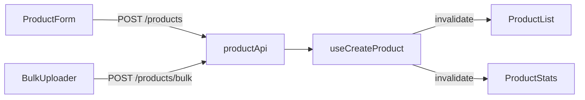
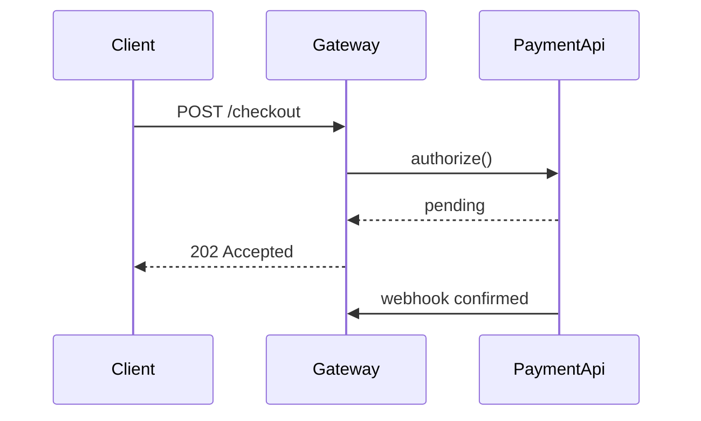
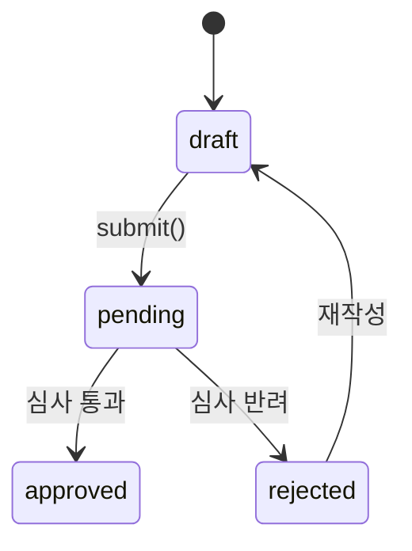
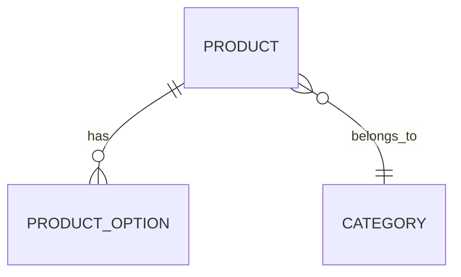
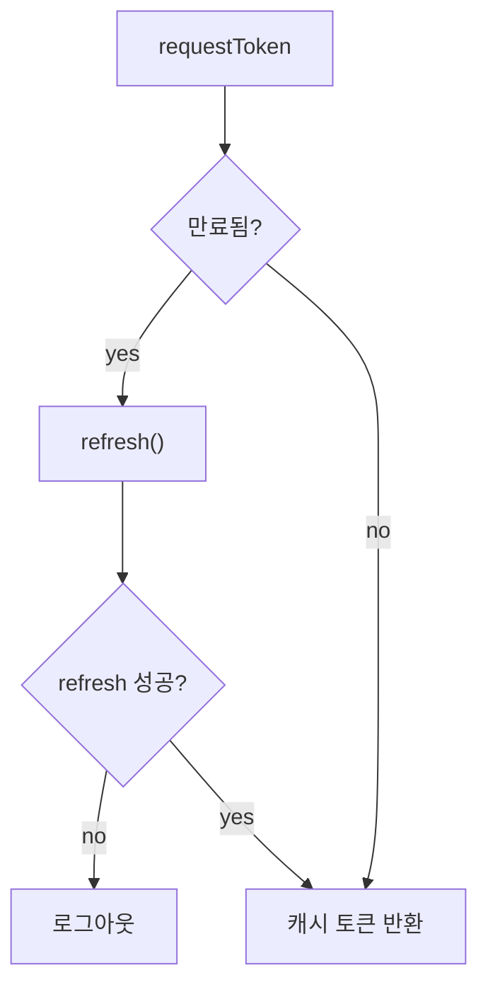

# Mermaid forms

Reach this file only after the R2 gate passed. Passing the gate is rare; if you are here for a straight-line flow, go back and delete the diagram.

Pick the form that matches what the change actually is. Do not default to `flowchart LR`.
If none of these fit, write the form that does fit, or omit the diagram. A forced diagram is worse than none.

---

## Fan-in or fan-out across layers

Use when one change is consumed by several callers, or several entry points converge on one new path. A single linear request path does not qualify — that is a bullet, not a diagram.



## Ordered exchange between actors

Use when the point is *sequence* — async ordering, retries, polling, handshakes, who waits on whom.



## State transitions

Use when a status field, lifecycle, or state machine was added or changed.



## Entity relations

Use when a schema, table, or model relationship changed.



## Branching or conditional logic

Use when the change introduces decision points a reader must follow.



---

## Draw the delta, not the architecture

A diagram of the whole system makes the reviewer misjudge what this PR touched. Draw the change.

- Include only nodes and edges this PR **adds or modifies**
- Include an unchanged node only when the changed part is unreadable without it, and mark it in the label: `B["productApi (기존)"]`
- Removed paths are omitted, not drawn as dead ends — the diff already shows deletions
- If more than half the nodes end up marked `기존`, the diagram is describing the system rather than the change; delete it

## Render safety

The diagram must render both on GitHub and in a local markdown preview. A block that fails to parse shows as raw text — strictly worse than no diagram. Keep to this conservative subset:

- **Quote every label** that contains anything beyond letters, digits, underscore, and spaces: `A["POST /products"]`, `B{"만료됨?"}`. Unquoted `(`, `)`, `[`, `]`, `{`, `}`, `/`, `<`, `>`, `#`, `:`, `"` inside a label break the parse
- Quote edge labels the same way: `A -->|"invalidate"| B`
- **Node IDs are ASCII** (`A`, `productApi`) — Korean or spaces in an ID break older parsers. Korean belongs in the label
- No `%%{init}%%` directives, no `classDef` / `class` / `style` lines, no theme config — styling is where renderers diverge most
- No HTML in labels, including `<br/>` — split into two nodes instead
- No comments except `%%` on its own line
- Keep a blank line above and below the ` ```mermaid ` fence

## Constraints

- One diagram per PR, maximum (R2 Step 3)
- Node labels use real identifiers from the diff — never `Component A`, `Service B`
- Label every edge with the actual call, event, or condition
- Over ~8 nodes means the group is too broad — split the group instead of shrinking the diagram
- If the diagram only restates what the bullets already say, delete it
