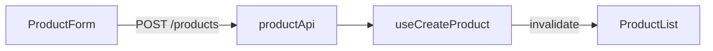
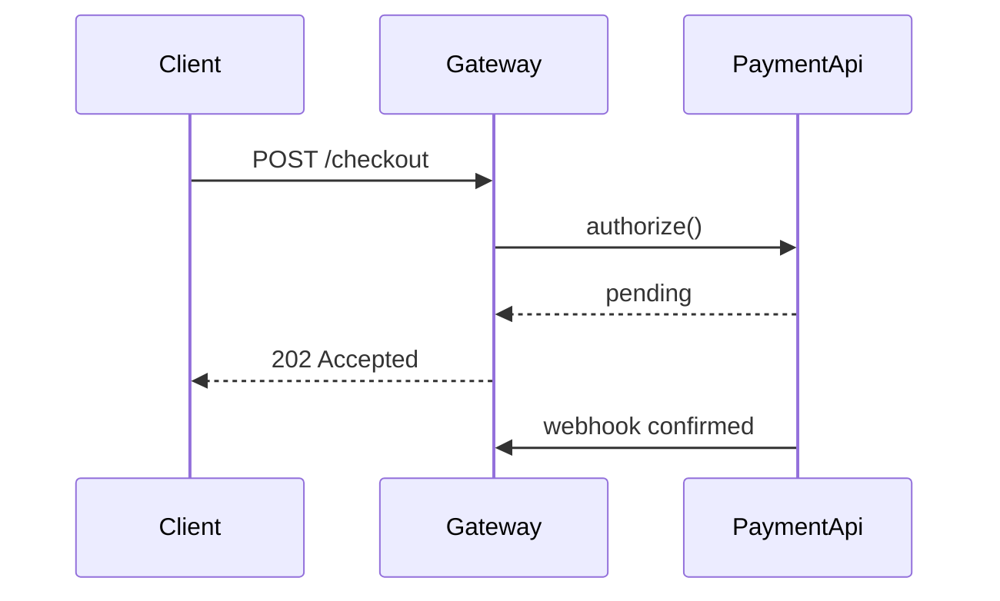
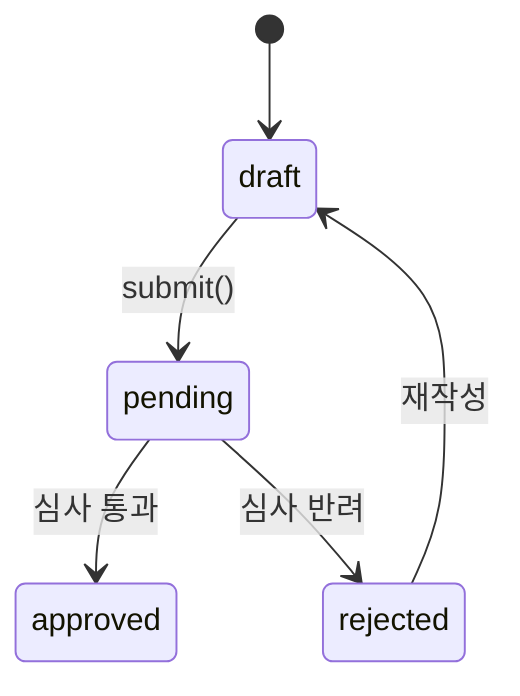
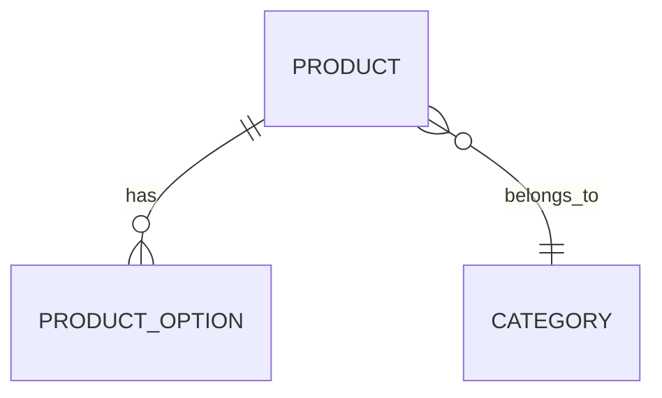

# Mermaid forms

Pick the form that matches what the change actually is. Do not default to `flowchart LR`.
If none of these fit, write the form that does fit, or omit the diagram. A forced diagram is worse than none.

---

## Data or call flow across layers

Use when a request/response path now crosses layers that did not connect before.



## Ordered exchange between actors

Use when the point is *sequence* — async ordering, retries, polling, handshakes, who waits on whom.



## State transitions

Use when a status field, lifecycle, or state machine was added or changed.



## Entity relations

Use when a schema, table, or model relationship changed.



## Branching or conditional logic

Use when the change introduces decision points a reader must follow.

```mermaid
flowchart TD
  A[requestToken] --> B{만료됨?}
  B -->|yes| C[refresh()]
  B -->|no| D[캐시 토큰 반환]
  C --> E{refresh 성공?}
  E -->|no| F[로그아웃]
  E -->|yes| D
```

---

## Constraints (all forms)

- One diagram per group, maximum
- Node labels use real identifiers from the diff — never `Component A`, `Service B`
- Label every edge with the actual call, event, or condition
- Over ~8 nodes means the group is too broad — split the group instead of shrinking the diagram
- If the diagram only restates the order already visible in the bullets, delete it
